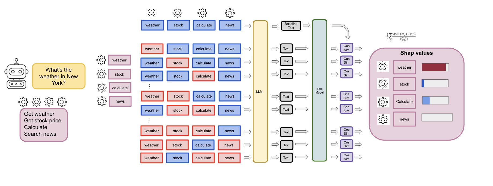
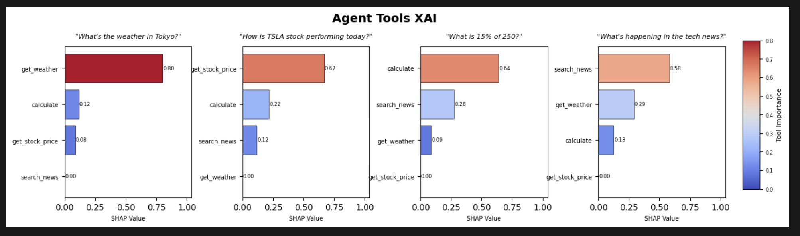

# AgentSHAP

AgentSHAP explains which tools an LLM agent relied on to answer a prompt.

## Visual Overview

### AgentSHAP Method



### Example Results



This repository includes:

- Core AgentSHAP library in `token_shap/`
- Runnable notebooks in `notebooks/`
- API-Bank based evaluation experiments in `experiments/`

## Current Implementation Status

The current codebase is configured for **local, low-cost usage by default**:

- Default model provider: **Ollama**
- Default model: **`qwen2.5:7b-instruct`**
- Default semantic vectorizer: **`sentence-transformers/all-MiniLM-L6-v2`**
- Optional cloud mode: any OpenAI-compatible endpoint via environment variables

## Repository Layout

```text
token_shap/
	agent_shap.py         # AgentSHAP analysis logic
	base.py               # Model and vectorizer abstractions (Ollama/OpenAI-compatible/local)
	tools.py              # Tool abstraction + helpers
	__init__.py

experiments/
	exp1_consistency.py
	exp2_faithfulness.py
	exp3_scalability.py
	exp4_irrelevant_injection.py
	exp5_cross_domain.py
	.env                  # Provider configuration
	DAMO-ConvAI/          # API-Bank source clone (required for experiments)

notebooks/
	AgentSHAP_Runnable.ipynb
	AgentSHAP Examples.ipynb
```

## Requirements

Install Python dependencies from the root:

```bash
pip install -r requirements.txt
```

## Quick Start (Ollama Default)

### 1. Start Ollama

```bash
ollama pull qwen2.5:7b-instruct
ollama serve
```

### 2. Configure environment

The experiments and notebooks read `experiments/.env`.

Minimum Ollama config:

```env
MODEL_PROVIDER=ollama
OLLAMA_MODEL_NAME=qwen2.5:7b-instruct
OLLAMA_API_URL=http://localhost:11434
```

### 3. Run notebook

Open `notebooks/AgentSHAP_Runnable.ipynb`, select your Python kernel, and run cells top-to-bottom.

## Optional: OpenAI-Compatible Cloud Provider

Set the following in `experiments/.env`:

```env
MODEL_PROVIDER=openai_compat
OPENAI_COMPAT_API_KEY=your_api_key
OPENAI_COMPAT_MODEL_NAME=gemini-2.5-flash
OPENAI_COMPAT_BASE_URL=https://generativelanguage.googleapis.com/v1beta/openai/
```

## Experiments

All experiments use API-Bank tools and prompts from Alibaba DAMO-ConvAI.

### 1) Clone API-Bank

```bash
cd experiments
git clone https://github.com/AlibabaResearch/DAMO-ConvAI.git
```

### 2) Run experiments

From `experiments/`:

```bash
python exp1_consistency.py
python exp2_faithfulness.py
python exp3_scalability.py
python exp4_irrelevant_injection.py
python exp5_cross_domain.py
```

If using Git Bash or WSL, you can run all at once:

```bash
bash run_all.sh
```

### Experiment goals

- **Exp 1 (Consistency):** stability of SHAP values across repeated runs
- **Exp 2 (Faithfulness):** removing high-SHAP tools should degrade quality more than low-SHAP tools
- **Exp 3 (Scalability):** runtime/call growth as tool count increases
- **Exp 4 (Irrelevant Injection):** decoy tools should receive near-zero importance
- **Exp 5 (Cross-Domain):** expected domain tool should rank highest

### Outputs

Each experiment writes CSV summaries and PNG figures to:

```text
experiments/results/
```

## Notes for Windows

- API-Bank files are read with UTF-8 in experiments to avoid `UnicodeDecodeError`.
- Some scripts still call `open <file>` at the end (macOS/Linux style). On Windows this may print a command-not-found message after successful completion; results are still saved to `experiments/results/`.

## Minimal API Example

```python
from token_shap import AgentSHAP, create_function_tool
from token_shap.base import OllamaModel, HuggingFaceEmbeddings

model = OllamaModel(model_name="qwen2.5:7b-instruct", api_url="http://localhost:11434")
vectorizer = HuggingFaceEmbeddings(model_name="sentence-transformers/all-MiniLM-L6-v2")

# Define tools, then run:
# agent = AgentSHAP(model=model, tools=tools, vectorizer=vectorizer)
# results_df, shapley_values = agent.analyze(prompt="...")
```

## License and Upstream

This project uses API-Bank benchmark components from the DAMO-ConvAI repository.
Please review upstream licenses and terms before redistribution or publication.
